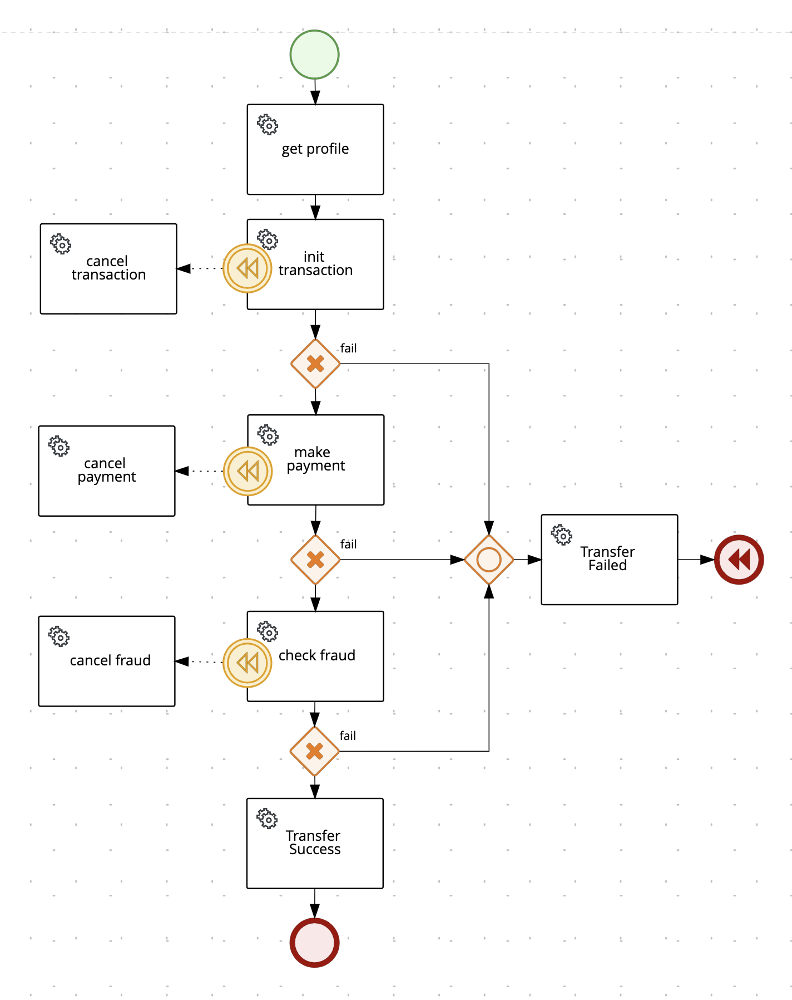
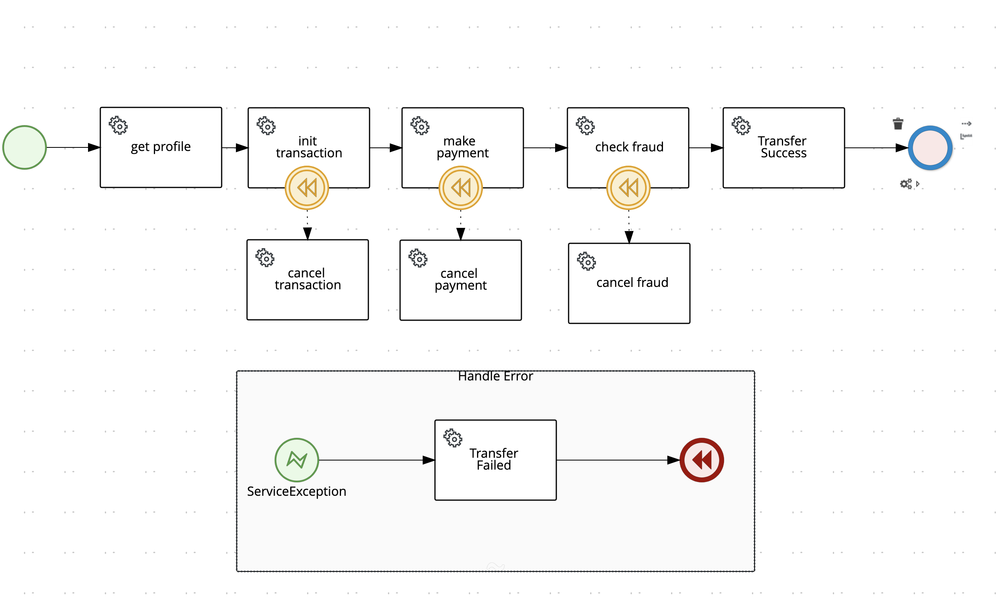

# Saga Process example using Kogito and Quarkus

Welcome to the introduction demo of implementing the Saga Pattern using Kogito visual designer and Quarkus.

##Kogito
[Kogito](https://kogito.kie.org/) is a Cloud-Native business automation project, created for building Intelligent Applications. Build and designed from the ground up, kogito was to run and scale on cloud infrstructire.  Takes avantages of modern technologies such as Quarkus and knative, to provide fast boot times and instant scaling on orchestration platform such as Kubernetes.


## Quakus
This project uses [Quarkus](https://quarkus.io/), the Supersonic Subatomic Java Framework.


## Overview

This turorial implement a the Saga pattern base on a BPMN (Business Process Model Notation)  build using Kogito. The example is base on a money order transfer.  

It consist of a number of steps:
1. Get profile
1. Init the transaction
1. Make the payment
1. check for fraud

Each steps could be anbd external call to a microservice, a serverless function etc. 
__For simplicity in this demo, The service are boken into their own files but are all part of the same applications.__


All steps in the process should be executes and must succeed for the transfer to successfull. If any of the steps fails, we then call the proper compensation or any step that was completed in order to have it rollback.


## Business Process

For this demo I have selected 2 ways of implemented the Saga pattern. Find below the images of the 2 differents business process.

### 1. With Error Response


### 2. With Error Handling.

## Running the application in dev mode


## Prerequisites:
* Java 11+
* Visual Studio with Kogito extension install
* Maven 3.8+


## Running the application in dev Mode

You can run your application in dev mode that enables live coding using:
```shell script
./mvnw compile quarkus:dev
```

## Packaging and running the application

The application can be packaged using:
```shell script
./mvnw clean compile package
```
It produces the `quarkus-run.jar` file in the `target/quarkus-app/` directory.
Be aware that it’s not an _über-jar_ as the dependencies are copied into the `target/quarkus-app/lib/` directory.

The application is now runnable using `java -jar target/quarkus-app/quarkus-run.jar`.

If you want to build an _über-jar_, execute the following command:
```shell script
./mvnw clean compile package -Dquarkus.package.type=uber-jar
```

The application, packaged as an _über-jar_, is now runnable using `java -jar target/*-runner.jar`.


## Access the API with Swagger UI
http://localhost:8080/q/swagger-ui/

## Call the application using curl


### Calling the process without error handling
```
curl -X 'POST' \
  'http://localhost:8080/transfer' \
  -H 'accept: */*' \
  -H 'Content-Type: application/json' \
  -d '{ "orderId" : "1234-5678"}'
```

_Response example:_
```
{"id":"07f7c012-3f0a-4c4d-b4ab-23b882a4332f","fraudResponse":{"type":"SUCCESS","resourceId":null},"paymentResponse":{"type":"SUCCESS","resourceId":null},"transactionResponse":{"type":"SUCCESS","resourceId":null},"transferResponse":null,"transferId":null,"userResponse":{"type":"SUCCESS","resourceId":null}
```


### Calling the process with error handling
```
curl -X 'POST' \
  'http://localhost:8080/transfer_error' \
  -H 'accept: */*' \
  -H 'Content-Type: application/json' \
  -d '{ "orderId" : "1234-5678"}'
```

_Response example:_
```
{"id":"074407e4-3b0a-49fc-8ef7-98869b5792da","fraudResponse":{"type":"SUCCESS","resourceId":null},"paymentResponse":{"type":"SUCCESS","resourceId":null},"transactionResponse":{"type":"SUCCESS","resourceId":null},"transferResponse":{"type":"SUCCESS","resourceId":null},"transferId":null,"userResponse":{"type":"SUCCESS","resourceId":null}}
```

## Simulation errors

To simulate errors, you can change either of the value in the _application.properties_ file. By changing one value to true, it will fail on that step.

```
service.transaction.error=false
service.fraud.error=false
service.payment.error=false
```


_WARNING_ Currently this code as not been tested to run outside of a local environment.